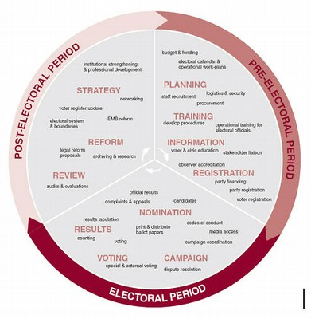

# IFES Elections Data Visualization


## Overview

Elections are essential for everyday people to influence the decisions that
affect their lives. For elections to succeed, election boards, monitors, and
other stakeholders need to support effective and inclusive practices. They also
need to identify and address election vulnerabilities.

Timing is important to both of these efforts. Although many of us are familiar
with the campaigning and voting of elections, many critical stages in the
electoral cycle occur long before or after election day. Stakeholders need to
know when these stages occur, so that they can support elections at each stage.

<p align="center">
  
</p>

The [International Foundation for Electoral Systems](https://www.ifes.org/)
(IFES) works with civil society, public institutions, and the private sector to
support free and fair elections around the world. They are partnering with
[DataKind DC](https://www.datakind.org/chapters/datakind-dc) to understand the
timing of these stages, both for individual elections and in the aggregate. This
work will help stakeholders consider:

- When will donations have the greatest impact?
- When are elections most at risk, and when is the time to act?

The result will provide insights about the timing of electoral cycles around the
world. It will use visuals to make those insights available to IFES staff,
election officials, donors, academics, and the public at
[electionguide.org](https://www.electionguide.org/).


## Get started

See the following resources to learn about the project:

- **GitHub:** https://github.com/DataKind-DC/ifes-elections
- **Documentation:** https://ifes-elections-data-visualization.readthedocs.io/
- **Application:** Stay tuned.

To install, first clone the repository:

```
git clone https://github.com/DataKind-DC/ifes-elections
```

Second, install the project Python package, possibly in a virtual env.

```
python3 -m venv env/ifes/
source env/ifes/bin/activate
pip install -e .
```

Third, put a ``.env`` file in the root directory. This file contains credentials
for activating the Election Guide API. Ask a data ambassador for access.

Finally, download the raw data to `data/raw/` using `make`:

```
make raw
```


## Objective and Outcomes

We aim to characterize the timing of electoral cycles around the world.

Although each election is different, most elections have common phases like
candidate registration, election day, and dispute resolution. We will use
historical election data from IFES to identify when these phases start and end
for individual countries and elections. We will also aggregate these timelines
to characterize archetypal elections. Some specific questions:

- How long are different election phases?
- How long before election day or inauguration do they occur?
- At what time of year do they occur?
- How frequently do they occur over time?

Our first deliverables will be rough, iterative visuals. These visuals will help
us identify key insights about electoral cycles and experiment with effective
presentation methods.

The final deliverable will polish the initial visuals and present them through
an interactive user interface, possibly hosted on
[electionguide.org](https://www.electionguide.org/).


## Data

Data will come from [electionguide.org](https://www.electionguide.org/), the
IFES election data clearinghouse. Stay tuned for details on the API and specific
sources and fields of interest.


## Phases

We will implement this project in several stages.

### Research and Design (Active)

- Identify key questions and outcomes.
- Identify and inspect data sources.
- Discuss and set up project infrastructure.

### Testing and Implementation
TODO

### Feedback and Wrap-up
TODO


## Workflow

There are several ways to contribute to this project. These areas of work are
independent and happen in parallel. They also build one another. The earlier
stages are informal and good for newcomers. The later stages are more formal
and a good fit for volunteers who are familiar with the project.

**Create issues.** Have an idea for a visualization or other improvement? You
can document the idea so that you or a teammate can make it happen. Be sure to
include a descriptive name. Also describe the desired feature as clearly and
with as much detail as possible.

**Explore.** Create a Jupyter Notebook or R Markdown document to explore some
aspect of the data, or to experiment with a new visualization. These documents
can be quick and informal. The goal is to spark useful discussions.

**Package good ideas.** Some exploratory work will produce code that others will
want to use. Think critically about the design, add to the codebase, and
document new functionality. This work is more formal, using unit tests,
documentation, coding conventions, and more centralized design to promote
maintainability and easy use.

**Go to production.** Work on the public facing application.


## Contribute

We welcome your help! Whether you like data wrangling, exploratory analysis,
documentation, visual design, or software development, your ideas and effort are
valuable. To get started:

1. Connect with us on the #elections channel of the DKDC Slack.
2. Check out our open [issues](https://github.com/DataKind-DC/ifes-elections/issues).
3. [Fork](https://docs.github.com/en/free-pro-team@latest/github/getting-started-with-github/fork-a-repo) this repository.
4. Submit a [pull request](https://docs.github.com/en/free-pro-team@latest/github/collaborating-with-issues-and-pull-requests/creating-a-pull-request) with your work.

On Slack you can meet the team, get on our meeting schedule, and determine how
your interests fit our priorities.


## Team

Our Data Ambassadors work with IFES staff and organize volunteer efforts.

- Nathan Banion ([nbanion](https://github.com/nbanion))
- Sanjay Ramchandani ([sramchandani](https://github.com/sramchandani))
- Pooja Tyagi ()
